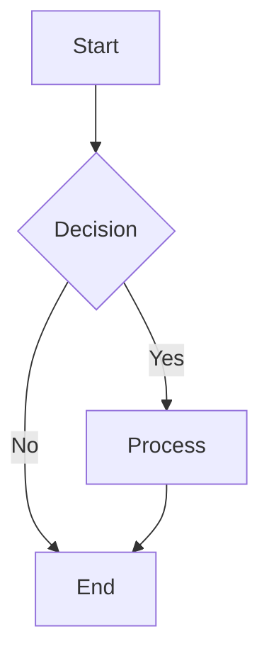

# MDXFlow - Markdown & Flowchart Editor

A powerful Markdown/MDX editor with an integrated drag-and-drop flowchart builder using React Flow and Mermaid. Create, edit, and visualize your ideas seamlessly with client-side storage and beautiful diagrams.

## ✨ Features

### 📝 **Markdown & MDX Editor**
- Write and edit documents in Markdown or MDX with live preview
- Support for GitHub Flavored Markdown (GFM)
- Custom MDX components (simplified version included)
- Real-time preview with split-pane interface

### 🎨 **Drag & Drop Flowcharts**
- Visual flowchart builder using React Flow
- Support for multiple node types: Start, Process, Decision, Input/Output, End
- Connect nodes with labeled edges
- Export flowcharts to Mermaid syntax

### 📊 **Mermaid Integration**
- Render beautiful diagrams directly in Markdown using ```mermaid code fences
- Client-side rendering with error handling
- Multiple diagram types supported
- Export from flowchart builder to Mermaid format

### 💾 **Local Storage**
- All documents stored locally in your browser
- No accounts needed - your data stays private
- Offline access and functionality
- Import/export capabilities

### 🔄 **Document Management**
- Create, edit, duplicate, and delete documents
- Search and filter documents by title or type
- Auto-save functionality
- Copy to clipboard and download as .md/.mdx files

### 🚀 **Export & Share**
- Download documents as Markdown or MDX files
- Copy content to clipboard
- Export Mermaid diagrams as .mmd files
- Insert flowcharts directly into new documents

## 🛠 Tech Stack

- **Framework**: Next.js 14 with App Router
- **Language**: TypeScript
- **Styling**: Tailwind CSS
- **Markdown**: react-markdown + remark-gfm
- **Diagrams**: Mermaid
- **Flow Builder**: React Flow
- **Storage**: Browser localStorage
- **Deployment**: Vercel-ready

## 🚀 Getting Started

### Prerequisites
- Node.js 18+ 
- npm, yarn, or pnpm

### Installation

1. Clone the repository:
```bash
git clone <repository-url>
cd mdxflow
```

2. Install dependencies:
```bash
npm install
# or
yarn install
# or
pnpm install
```

3. Start the development server:
```bash
npm run dev
# or
yarn dev
# or
pnpm dev
```

4. Open [http://localhost:3000](http://localhost:3000) in your browser

## 📖 Usage

### Creating Documents
1. Click "New Document" or visit `/editor/new`
2. Choose between Markdown or MDX format
3. Start writing your content with live preview

### Building Flowcharts
1. Navigate to the Flow Builder (`/builder`)
2. Drag and drop nodes from the palette
3. Connect nodes by dragging from connection points
4. Customize node labels and types
5. Export to Mermaid or insert into a document

### Using Mermaid in Documents
In Markdown documents:
```markdown

```

### Document Management
- View all documents at `/documents`
- Search by title or document type
- Edit, duplicate, or delete documents
- Export individual documents

## 🏗 Project Structure

```
mdxflow/
├── app/                    # Next.js App Router pages
│   ├── builder/           # Flow builder page
│   ├── documents/         # Document listing page
│   ├── editor/           # Editor pages
│   │   ├── new/          # New document creation
│   │   └── [id]/         # Document editor
│   ├── layout.tsx        # Root layout
│   └── page.tsx          # Home page
├── components/           # React components
│   ├── MarkdownPreview.tsx  # Markdown renderer with Mermaid
│   └── MDXPreview.tsx      # MDX renderer (simplified)
├── lib/                  # Utility libraries
│   ├── storage.ts        # localStorage operations
│   ├── mermaidUtils.ts   # React Flow to Mermaid conversion
│   └── file.ts           # File download/clipboard utilities
└── types/               # TypeScript declarations
```

## 🎯 Core Functionality

### Storage
Documents are stored in localStorage with the following structure:
- `mdxflow:documents` - Array of document metadata and content
- `mdxflow:pendingInsert` - Temporary storage for flowchart insertion

### Data Models
```typescript
interface DocumentData {
  id: string;
  title: string;
  content: string;
  type: 'markdown' | 'mdx';
  updatedAt: number;
}
```

### Flowchart to Mermaid
The flow builder converts React Flow graphs to Mermaid syntax:
- Node types map to different Mermaid shapes
- Connections become arrows with optional labels
- Direction can be customized (TD, LR, etc.)

## 🚀 Deployment

### Deploy to Vercel

1. Push your code to GitHub
2. Connect your repository to Vercel
3. Deploy with default settings (no additional configuration needed)

### Deploy to Other Platforms

The app is a static Next.js application and can be deployed to:
- Netlify
- GitHub Pages
- AWS S3 + CloudFront
- Any static hosting provider

Build the application:
```bash
npm run build
npm run export  # If using static export
```

## 🔧 Configuration

### Mermaid Themes
Mermaid is configured with default settings in the preview components. You can customize themes by modifying the initialization in:
- `components/MarkdownPreview.tsx`
- `components/MDXPreview.tsx`

### Storage Settings
Storage keys and default content can be modified in `lib/storage.ts`.

## 🤝 Contributing

1. Fork the repository
2. Create a feature branch (`git checkout -b feature/amazing-feature`)
3. Commit your changes (`git commit -m 'Add amazing feature'`)
4. Push to the branch (`git push origin feature/amazing-feature`)
5. Open a Pull Request

## 📝 License

This project is licensed under the MIT License - see the LICENSE file for details.

## 🙏 Acknowledgments

- [Next.js](https://nextjs.org/) for the amazing React framework
- [React Flow](https://reactflow.dev/) for the flowchart builder
- [Mermaid](https://mermaid.js.org/) for diagram rendering
- [react-markdown](https://github.com/remarkjs/react-markdown) for Markdown support
- [Tailwind CSS](https://tailwindcss.com/) for styling

---

Built with ❤️ using Next.js, React Flow, and Mermaid.
