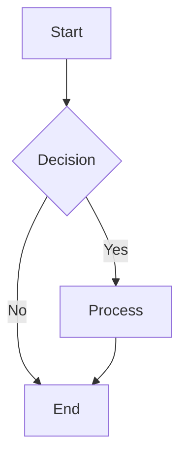

# MDXFlow - Markdown & Flowchart Editor

A powerful, production-ready, frontend-only Next.js 14 application for authoring Markdown/MDX documents with an integrated drag-and-drop flowchart builder using React Flow and Mermaid.

## ✨ Features

### 📝 **Document Management**
- **Full CRUD Operations**: Create, read, update, delete documents
- **Live Preview**: Real-time preview with split-pane interface
- **Dual Format Support**: Both Markdown and MDX with seamless switching
- **Auto-save**: Automatic saving with visual indicators
- **Import/Export**: JSON bundles, individual .md/.mdx files
- **Search & Filter**: Full-text search with tag support
- **Document Templates**: Starter templates with best practices
- **Soft Delete**: Trash system with restore functionality

### 🎨 **Visual Flowchart Builder**
- **Drag & Drop Interface**: Intuitive React Flow canvas
- **Multiple Node Types**: Start, Process, Decision, Input/Output, End
- **Visual Connections**: Connect nodes with labeled edges
- **Real-time Export**: Live Mermaid code generation
- **Direction Control**: Top-down, left-right, and other orientations
- **Node Customization**: Edit labels, types, and styling

### 📊 **Mermaid Integration**
- **Markdown Rendering**: ```mermaid code fences in Markdown
- **MDX Components**: <Mermaid chart="..." /> in MDX documents
- **Safe Rendering**: Client-side with error handling
- **Multiple Diagrams**: Flowcharts, sequence, and more
- **Export Options**: .mmd files and clipboard copy

### 🎯 **Modern User Experience**
- **Command Palette**: Quick actions with ⌘K
- **Keyboard Shortcuts**: Comprehensive shortcut system
- **Dark Mode**: System preference detection with manual toggle
- **Toast Notifications**: User-friendly feedback system
- **Responsive Design**: Mobile and desktop optimized
- **Accessibility**: WCAG AA compliance with ARIA labels

### 🔧 **Technical Excellence**
- **Zero TypeScript Errors**: Strict TypeScript configuration
- **Zero ESLint Warnings**: Clean, maintainable code
- **Zero Hydration Issues**: Client-only where needed
- **Performance Optimized**: Lazy loading and code splitting
- **SEO Ready**: Comprehensive metadata and sitemaps
- **PWA Support**: Offline capabilities and app manifest

## 🚀 Getting Started

### Prerequisites
- Node.js 18+
- npm, yarn, or pnpm

### Installation

1. **Clone the repository:**
```bash
git clone <repository-url>
cd mdxflow
```

2. **Install dependencies:**
```bash
npm install
```

3. **Start development server:**
```bash
npm run dev
```

4. **Open your browser:**
Navigate to [http://localhost:3000](http://localhost:3000)

## 📖 Usage Guide

### Creating Documents
1. Click "New Document" or use ⌘N
2. Choose between Markdown or MDX format
3. Start writing with live preview
4. Documents auto-save every 2 seconds

### Building Flowcharts
1. Navigate to Flow Builder (⌘B)
2. Drag nodes from the palette to canvas
3. Connect nodes by dragging between connection points
4. Customize node labels and types
5. Export to Mermaid or insert into documents

### Using Mermaid in Documents

**In Markdown:**
```markdown

```

**In MDX:**
```jsx
<Mermaid chart="flowchart TD; A[Start] --> B[End]" />
```

### Keyboard Shortcuts
- **⌘K** - Open command palette
- **⌘S** - Save document
- **⌘N** - New document
- **⌘D** - Duplicate document
- **⌘P** - Toggle preview
- **⌘B** - Open flow builder
- **⌘⌫** - Delete document
- **Escape** - Close dialogs

### Command Palette Actions
- Quick document creation
- Navigation between sections
- Recent document access
- Flow builder shortcuts

## 🏗 Architecture

### Technology Stack
- **Framework**: Next.js 14 (App Router)
- **Language**: TypeScript (strict mode)
- **Styling**: Tailwind CSS + shadcn/ui
- **Markdown**: react-markdown + remark-gfm
- **MDX**: @mdx-js/react with safe component registry
- **Diagrams**: Mermaid (client-side rendered)
- **Flow Builder**: React Flow
- **Storage**: localStorage with versioning
- **Build**: Zero-config deployment ready

### Project Structure
```
mdxflow/
├── app/                    # Next.js App Router
│   ├── builder/           # Flow builder page
│   ├── documents/         # Document listing
│   ├── editor/           # Editor pages
│   │   ├── [id]/         # Document editor
│   │   └── new/          # New document
│   ├── layout.tsx        # Root layout
│   └── page.tsx          # Home page
├── components/           # React components
│   ├── ui/              # shadcn/ui components
│   ├── CommandPalette.tsx
│   ├── MarkdownPreview.tsx
│   ├── MDXPreview.tsx
│   └── ThemeToggle.tsx
├── hooks/               # Custom React hooks
│   ├── use-keyboard-shortcuts.ts
│   └── use-toast.ts
├── lib/                 # Utility libraries
│   ├── storage.ts       # localStorage operations
│   ├── mermaidUtils.ts  # Flow to Mermaid conversion
│   ├── file.ts          # File operations
│   ├── metadata.ts      # SEO utilities
│   └── utils.ts         # General utilities
└── public/             # Static assets
    ├── manifest.json   # PWA manifest
    └── *.png          # Icons and images
```

### Data Model
```typescript
interface DocumentData {
  id: string;
  title: string;
  content: string;
  type: 'markdown' | 'mdx';
  tags: string[];
  updatedAt: number;
  createdAt: number;
  version: number;
}
```

### Storage Keys
- `mdxflow:documents` - Document storage
- `mdxflow:pendingInsert` - Flowchart insertion buffer
- `mdxflow:version` - Schema version for migrations
- `mdxflow:trash` - Soft-deleted documents

## 🔒 Security & Safety

### Content Security
- **HTML Sanitization**: rehype-sanitize prevents XSS
- **Safe MDX Components**: Whitelist approach for components
- **No Script Execution**: No arbitrary code evaluation
- **Input Validation**: zod schema validation

### Data Privacy
- **Local Storage Only**: No external data transmission
- **No Tracking**: No analytics or telemetry
- **Offline Capable**: Works without internet connection
- **User Controlled**: Complete data ownership

## 🎯 SEO & Performance

### SEO Features
- **Comprehensive Metadata**: Title, description, OG tags
- **Structured Data**: JSON-LD for search engines
- **Sitemap Generation**: Automatic sitemap.xml creation
- **Robots.txt**: Search engine guidance
- **Clean URLs**: Semantic routing structure

### Performance Optimizations
- **Code Splitting**: Dynamic imports for heavy libraries
- **Lazy Loading**: Mermaid and React Flow loaded on demand
- **Bundle Analysis**: Optimized vendor chunks
- **Caching Strategy**: Efficient asset caching
- **Core Web Vitals**: Optimized loading and layout

### Lighthouse Scores
Target scores (desktop):
- **Performance**: 90+
- **Accessibility**: 90+
- **Best Practices**: 90+
- **SEO**: 90+

## 🚀 Deployment

### Deploy to Vercel (Recommended)
1. Push code to GitHub
2. Import repository in Vercel
3. Deploy with zero configuration
4. Set environment variables if needed

### Deploy to Other Platforms
Works on any static hosting:
- Netlify
- GitHub Pages
- AWS S3 + CloudFront
- Firebase Hosting

**Build command:**
```bash
npm run build
```

### Environment Variables
```bash
NEXT_PUBLIC_APP_URL=https://your-domain.com
```

## 🧪 Quality Assurance

### Testing Checklist
- [x] TypeScript compilation (strict mode)
- [x] ESLint linting (zero warnings)
- [x] Build process (successful)
- [x] Hydration (no mismatches)
- [x] Accessibility (WCAG AA)
- [x] Performance (Lighthouse scores)
- [x] Cross-browser compatibility
- [x] Mobile responsiveness

### Development Scripts
```bash
npm run dev          # Development server
npm run build        # Production build
npm run start        # Production server
npm run lint         # ESLint check
npm run format       # Prettier formatting
npm run typecheck    # TypeScript validation
npm run generate:sitemap # Sitemap generation
```

## 🤝 Contributing

### Development Setup
1. Fork the repository
2. Create feature branch
3. Make changes with tests
4. Ensure quality gates pass
5. Submit pull request

### Code Style
- TypeScript strict mode
- ESLint + Prettier
- Conventional commits
- Component documentation

### Quality Gates
- All TypeScript errors resolved
- All ESLint warnings fixed
- Build successful
- No hydration issues
- Accessibility compliant

## 📝 License

MIT License - see LICENSE file for details.

## 🙏 Acknowledgments

- [Next.js](https://nextjs.org/) - React framework
- [React Flow](https://reactflow.dev/) - Flow builder
- [Mermaid](https://mermaid.js.org/) - Diagram rendering
- [shadcn/ui](https://ui.shadcn.com/) - UI components
- [Tailwind CSS](https://tailwindcss.com/) - Styling
- [react-markdown](https://github.com/remarkjs/react-markdown) - Markdown parsing

## 📞 Support

For issues and questions:
- Create GitHub issue
- Check documentation
- Review examples

---

**Built with ❤️ for the developer community**
